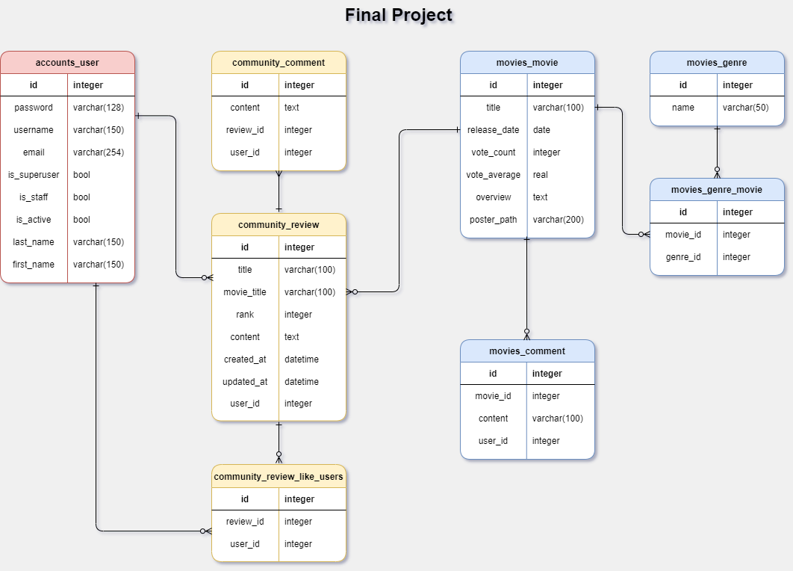

# FINAL PROJECT (추천 시스템 기반 영화 사이트)

⮞*손한기*, *장하석*

싸피 6기 1학기 관통 프로젝트입니다.

- 자체 데이터 베이스를 구축해서 20년 분량의 영화 데이터를 확인할 수 있도록 하였습니다.
- 자연어 처리를 바탕으로 데이터를 가공하여 학습모델을 만든 뒤, 영화 추천시스템을 구축하였습니다.
- 유저간의 커뮤니케이션을 위한 게시판을 만들었습니다.

## 목차

- [Maintainers](#Maintainers)
- [미리보기](#미리보기)
- [설치](#설치)
- [ERD](#ERD)
- [개발 일지](#개발 일지)


# Maintainers


# 미리보기

- 대충 미리보기  gif 있는 곳


# 설치

**⭐설치 전 유의 사항⭐**

- 본 프로젝트는 VScode, node.js, vue, Django, SQLite, JAVA 를 사용하고 있습니다.
- 현재 Konlpy에 issues 가 있습니다. pip install 시 수동으로 파일을 붙여넣어 주세요.

**⭐설치 순서⭐**

- git clone https://lab.ssafy.com/haseok1020/pjt-final.git
- 가상환경 설정
- vs code 를 통해 pip install -r requirements.txt 진행
- assets 에 jvm을 덮어 쓰기 해 주세요 (issues 참고)
- server dir 진입 후 migrate 
- assets 폴더에 있는 dbinsert.sql 을 이용하여 csv 파일 3개를 import 해주세요
- 이후 python manage.py runserver
- client dir 진입 후 npm istall package-lock.json 진행
- 이후 npm run serve

### Issues

---

**⭐ assets의 jvm.py 파일을 pjt-final\server\venv\Lib\site-packages\konlpy 위치에 덮어쓰기 해주세요 ⭐**

****

```
⭐for mac

1. silicon mac은 pip install 문제로 recommend는 사용 불가
   -> pip install -r requirements_mac.txt
2. 일반 맥은 설치가 안되면 pip 대신 conda를 사용해 보세요
   ⭐
```

---

**⭐Error: EBUSY: resource busy or locked 에러 발생시**

- npm install next-redux-wrapper 진행해 주세요

----


i. 팀원 정보 및 업무 분담 내역 

ii. 목표 서비스 구현 및 실제 구현 정도 

iii. 데이터베이스 모델링(ERD) 

iv. 필수 기능에 대한 설명 v. 배포 서버 URL vi. 기타(느낀점)Usage


# ERD



# 개발 일지


# 


