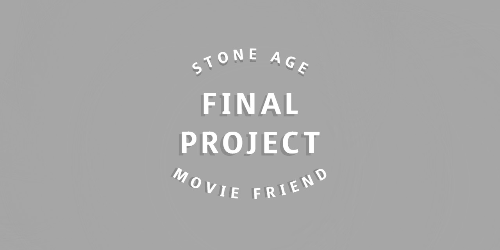

# Project Final

###### 


**⭐ assets의 jvm.py 파일을 pjt-final\server\venv\Lib\site-packages\konlpy 위치에 덮어쓰기 해주세요 ⭐**

****

```
⭐for mac

1. silicon mac은 pip install 문제로 recommend는 사용 불가
   -> pip install -r requirements_mac.txt
2. 일반 맥은 설치가 안되면 pip 대신 conda를 사용해 보세요
   ⭐
```

---

**⭐Error: EBUSY: resource busy or locked 에러 발생시**

- npm install next-redux-wrapper 진행해 주세요

i. 팀원 정보 및 업무 분담 내역 

ii. 목표 서비스 구현 및 실제 구현 정도 

iii. 데이터베이스 모델링(ERD) 

iv. 필수 기능에 대한 설명 v. 배포 서버 URL vi. 기타(느낀점)




# FINAL PROJECT (추천 시스템 기반 영화 사이트)

⮞*손한기*, *장하석*

싸피 6기 1학기 관통 프로젝트입니다.


# 미리보기

After you have written about your project, it is a good idea to have a demo/preview(**video/gif/screenshots** are good options) of your project so that people can know what to expect in your project. You could also add the demo in the previous section with the product description.

Here is a random GIF as a placeholder.

[

## 목차

- [Installation](#installation)
- [Usage](#usage)
- [Development](#development)
- [Contribute](#contribute)
    + [Adding new features or fixing bugs](#adding-new-features-or-fixing-bugs)
- [Contribute](#contribute-1)

# Installation

[(Back to top)](https://github.com/navendu-pottekkat/awesome-readme#table-of-contents)

*You might have noticed the **Back to top** button(if not, please notice, it's right there!). This is a good idea because it makes your README **easy to navigate.***

The first one should be how to install(how to generally use your project or set-up for editing in their machine).

This should give the users a concrete idea with instructions on how they can use your project repo with all the steps.

Following this steps, **they should be able to run this in their device.**

A method I use is after completing the README, I go through the instructions from scratch and check if it is working.

Here is a sample instruction:

To use this project, first clone the repo on your device using the command below:

```
git init
git clone https://github.com/navendu-pottekkat/nsfw-filter.git
```

# Usage


# Development


# Contribute


### Adding new features or fixing bugs


# Contribute


# Footer


